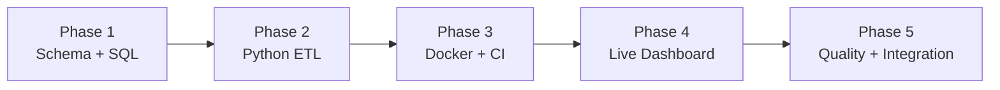
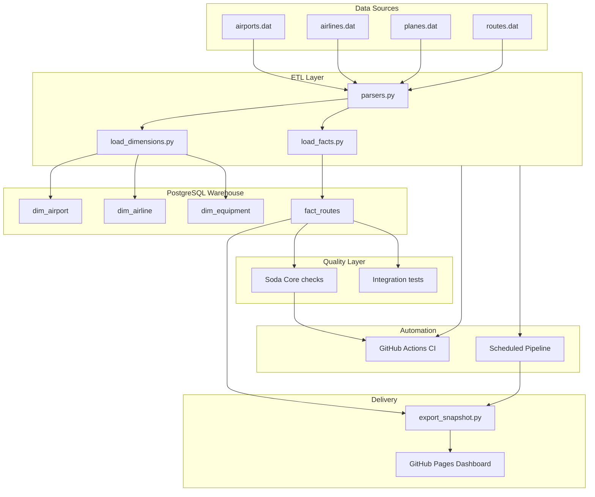

# Open Flights Data Pipeline — Complete Documentation

[](https://github.com/gvarun20/openflights-pipeline/actions/workflows/ci.yml)
[](https://github.com/gvarun20/openflights-pipeline/actions/workflows/scheduled-etl.yml)
[](https://gvarun20.github.io/openflights-pipeline/)

> **End-to-end data engineering project:** raw OpenFlights aviation data → validated PostgreSQL star-schema warehouse → automated CI/CD → live public dashboard.

| | |
|---|---|
| **Live dashboard** | https://gvarun20.github.io/openflights-pipeline/ |
| **Repository** | https://github.com/gvarun20/openflights-pipeline |
| **CI runs** | https://github.com/gvarun20/openflights-pipeline/actions |
| **Routes loaded** | **66,316** |
| **Automated tests** | **23** (18 unit + 5 integration) |
| **Data quality checks** | **8** (Soda Core) |
| **License** | MIT |

---

## Table of contents

1. [Why this project exists](#1-why-this-project-exists)
2. [Project goals and scope](#2-project-goals-and-scope)
3. [How the project progressed — phase by phase](#3-how-the-project-progressed--phase-by-phase)
4. [System architecture](#4-system-architecture)
5. [Technology stack](#5-technology-stack)
6. [Data sources](#6-data-sources)
7. [Data model (star schema)](#7-data-model-star-schema)
8. [ETL pipeline](#8-etl-pipeline)
9. [Data quality framework (Soda Core)](#9-data-quality-framework-soda-core)
10. [Testing strategy](#10-testing-strategy)
11. [Unit tests — detailed breakdown](#11-unit-tests--detailed-breakdown)
12. [Integration tests — detailed breakdown](#12-integration-tests--detailed-breakdown)
13. [CI/CD and automation (GitHub Actions)](#13-cicd-and-automation-github-actions)
14. [Dashboard and analytics delivery](#14-dashboard-and-analytics-delivery)
15. [Docker and reproducibility](#15-docker-and-reproducibility)
16. [Repository structure](#16-repository-structure)
17. [Setup guide](#17-setup-guide)
18. [Environment variables](#18-environment-variables)
19. [SQL analytics queries](#19-sql-analytics-queries)
20. [Key metrics and business insights](#20-key-metrics-and-business-insights)
21. [Skills demonstrated](#21-skills-demonstrated)
22. [Future improvements (production roadmap)](#22-future-improvements-production-roadmap)

---

## 1. Why this project exists

### 1.1 The business problem

Aviation route data is published by [OpenFlights](https://openflights.org/data.html) as flat `.dat` files. These files are useful for research and hobby projects, but they are **not ready for analytics or reporting** in their raw form:

| Raw data limitation | Impact |
|---------------------|--------|
| Flat files, not relational | Cannot JOIN airlines to routes to airports in SQL |
| No schema enforcement | Missing values, wrong code lengths, orphan references |
| No repeatable load process | Every analysis starts from manual CSV work |
| No quality validation | Silent data corruption goes undetected |
| No public demo | Hard to show work to recruiters or stakeholders |

A data team answering questions like *“Which hub has the most connections?”* or *“What is the busiest international corridor?”* needs a **warehouse**, a **pipeline**, and **trust in the data**.

### 1.2 The technical problem

OpenFlights data has real-world messiness:

- Null values encoded as `\N`, not SQL `NULL`
- IATA/ICAO codes with inconsistent lengths
- Routes referencing airline or airport IDs that do not exist in dimension files (~449 routes skipped)
- No timestamps, so “freshness” must be managed by the pipeline itself

Without an ETL layer, every analyst re-implements the same parsing and cleaning logic.

### 1.3 What this project delivers

This repository implements a **production-style data engineering workflow**:

```
Raw .dat files  →  Python ETL  →  PostgreSQL warehouse  →  Quality checks  →  Dashboard
                         ↑                    ↑                    ↑
                   Docker + CI         Soda Core            GitHub Pages (live)
```

**In plain terms:** anyone can clone the repo, run one command, load 66,000+ routes into a proper star schema, verify the data is correct, and view results on a public dashboard — with no cloud account required.

---

## 2. Project goals and scope

### 2.1 Goals

| Goal | How it is achieved |
|------|-------------------|
| Model data for analytics | PostgreSQL star schema with fact + dimension tables |
| Automate ingestion | Python ETL with CLI (`run_etl.py`) |
| Guarantee data trust | Soda Core checks + pytest integration tests |
| Reproduce anywhere | Docker Compose + documented `.env` setup |
| Prove reliability | GitHub Actions CI on every push |
| Deliver insights publicly | Chart.js dashboard on GitHub Pages |
| Document decisions | This file + README architecture diagram |

### 2.2 Scope (what is included)

- Batch ETL from OpenFlights `.dat` files
- PostgreSQL warehouse (local or Docker)
- Unit and integration testing
- Data quality validation
- CI/CD and weekly scheduled refresh
- Static live dashboard

### 2.3 Out of scope (deliberate choices)

| Excluded | Reason |
|----------|--------|
| AWS / cloud hosting | Free, credit-card-free deployment via GitHub Pages |
| Real-time streaming | OpenFlights data is batch-oriented |
| Jenkins / Ansible | GitHub Actions + Docker cover CI and reproducibility |
| Airflow / heavy orchestration | Scheduled GitHub Action is sufficient at this scale |

These are documented as [future improvements](#22-future-improvements-production-roadmap) where appropriate.

---

## 3. How the project progressed — phase by phase

The project was built incrementally. Each phase added a layer that real data teams use in production.

### Phase 1 — Data modelling and SQL foundation

**Objective:** Design a warehouse before writing any Python.

**What was built:**

| Deliverable | Location | Purpose |
|-------------|----------|---------|
| Star schema DDL | `sql/schema.sql` | Tables, FKs, indexes |
| Analytics queries | `sql/queries.sql` | CTEs, window functions, self-joins |
| Raw data files | `openflights-pipeline/data/*.dat` | Source of truth |

**Key decisions:**

- **Star schema** over snowflake — simpler JOINs for BI and dashboards
- **Role-playing `dim_airport`** — one table serves both source and destination
- **SCD Type 2 columns on `dim_airline`** — ready for historical airline changes
- **`dim_date` table** — designed for future schedule data (not populated yet)

**Outcome:** A clear target schema that the ETL must populate.

---

### Phase 2 — Python ETL and PostgreSQL load

**Objective:** Automate extract, transform, and load from raw files into the warehouse.

**What was built:**

| Module | Responsibility |
|--------|----------------|
| `etl/parsers.py` | Parse `.dat` rows; handle `\N`, code lengths, types |
| `etl/load_dimensions.py` | Load airports, airlines, equipment |
| `etl/load_facts.py` | Load routes with FK validation |
| `etl/db.py` | Connection, schema init, sequence reset |
| `etl/run_etl.py` | CLI entry point |

**Load results:**

| Metric | Value |
|--------|------:|
| Routes parsed | 67,663 |
| Routes loaded | **66,316** |
| Skipped (null IDs) | 898 |
| Skipped (missing FK) | 449 |

**Why routes are skipped:** OpenFlights route records sometimes reference airline or airport IDs absent from the dimension files. The pipeline **rejects invalid rows** rather than inserting broken foreign keys — a deliberate data integrity choice.

**Outcome:** Repeatable one-command load into PostgreSQL.

---

### Phase 3 — Docker, testing, and CI

**Objective:** Make the project reproducible and safe to change.

**What was built:**

| Deliverable | Purpose |
|-------------|---------|
| `Dockerfile` | Portable ETL container |
| `docker-compose.yml` | Postgres + ETL with healthchecks |
| `tests/test_etl.py` | 18 unit tests for parsers |
| `.github/workflows/ci.yml` | Automated test + build on every push |
| `pytest.ini` | Correct Python import path for CI |

**Problem solved in CI:** Early CI failed with `ModuleNotFoundError: No module named 'etl'`. Fixed by setting `pythonpath = .` in `pytest.ini` and running `python -m pytest`.

**Outcome:** Green CI badge; anyone can verify the pipeline without manual steps.

---

### Phase 4 — Live dashboard and portfolio delivery

**Objective:** Provide a public URL for recruiters and stakeholders.

**What was built:**

| Deliverable | Purpose |
|-------------|---------|
| `docs/index.html` | Chart.js dashboard (KPIs, charts, tables) |
| `docs/data.json` / `docs/data.js` | Snapshot data from warehouse |
| `dashboard/export_snapshot.py` | SQL → JSON export |
| `.github/workflows/pages.yml` | Deploy to `gh-pages` branch |

**Dashboard highlights:** Top airports, airlines, country corridors, network hubs, aircraft types, domestic vs international split.

**Live URL:** https://gvarun20.github.io/openflights-pipeline/

**Outcome:** Portfolio-ready demo without AWS or Streamlit Cloud.

---

### Phase 5 — Data quality, integration testing, and scheduled automation

**Objective:** Move from “it loads” to “we **trust** what loaded.”

**What was built:**

| Deliverable | Purpose |
|-------------|---------|
| `quality/checks.yml` | 8 Soda Core data quality rules |
| `quality/run_checks.py` | Execute checks after ETL |
| `tests/test_integration.py` | 5 tests against real PostgreSQL |
| `etl/run_etl.py --validate` | ETL + quality in one step |
| `.github/workflows/scheduled-etl.yml` | Weekly ETL → export → deploy |
| `scripts/run_pipeline.ps1` | One-command local pipeline |

**Outcome:** Automated validation in CI; weekly dashboard refresh; documented quality framework.

---

### Phase summary timeline



| Phase | Focus | Status |
|-------|-------|--------|
| 1 | Star schema, SQL analytics | ✅ Complete |
| 2 | Python ETL, 66,316 routes loaded | ✅ Complete |
| 3 | Docker, pytest, GitHub Actions CI | ✅ Complete |
| 4 | GitHub Pages dashboard, documentation | ✅ Complete |
| 5 | Soda quality, integration tests, scheduled pipeline | ✅ Complete |

---

## 4. System architecture

### 4.1 End-to-end data flow



### 4.2 Layer responsibilities

| Layer | Responsibility | Failure mode if missing |
|-------|----------------|-------------------------|
| **Extract** | Read raw `.dat` files | Manual copy-paste into spreadsheets |
| **Transform** | Parse, validate, type-cast | Wrong types, silent null bugs |
| **Load** | Insert into star schema with FK rules | Orphan rows, broken analytics |
| **Quality** | Soda checks on loaded tables | Bad data reaches dashboard |
| **Testing** | Unit + integration pytest | Regressions ship undetected |
| **CI/CD** | Run pipeline on every change | “Works on my machine” |
| **Delivery** | Export JSON + static dashboard | No public demo |

---

## 5. Technology stack

| Layer | Technology | Version / notes |
|-------|------------|-----------------|
| **Language** | Python | 3.11+ (3.11 in Docker/CI; 3.12 locally on Windows) |
| **Database** | PostgreSQL | 16 (Docker/CI), 18 (local Windows install) |
| **DB driver** | psycopg2-binary | ≥ 2.9.9 |
| **Config** | python-dotenv | ≥ 1.0.0 |
| **Data quality** | Soda Core (soda-core-postgres) | ≥ 3.5.0 |
| **Containerisation** | Docker + docker-compose | ETL + Postgres services |
| **Testing** | pytest, pytest-cov | 23 tests total |
| **Linting** | flake8 | CI (non-blocking, critical errors only) |
| **CI/CD** | GitHub Actions | CI, scheduled ETL, Pages deploy |
| **Dashboard** | HTML + Chart.js 4.4.1 | GitHub Pages (`docs/`) |
| **Optional dashboard** | Streamlit + pandas | Local only (`dashboard/app.py`) |

### Dependencies

**Production** (`requirements.txt`):
```
psycopg2-binary>=2.9.9
python-dotenv>=1.0.0
```

**Development** (`requirements-dev.txt`):
```
pytest>=8.0.0
pytest-cov>=4.1.0
soda-core-postgres>=3.5.0
```

---

## 6. Data sources

All files from [OpenFlights Data](https://openflights.org/data.html):

| File | Records | Target table | Notes |
|------|--------:|--------------|-------|
| `airports.dat` | 7,698 | `dim_airport` | Name, city, country, IATA/ICAO, coordinates |
| `airlines.dat` | 6,162 | `dim_airline` | Name, country, active flag, codes |
| `planes.dat` | 246 | `dim_equipment` | IATA aircraft code + name |
| `routes.dat` | 67,663 parsed | `fact_routes` | 66,316 loaded after FK filtering |

**Location:** `openflights-pipeline/data/`

**Format conventions:**
- Comma-separated values (CSV-like)
- `\N` means null
- `-` sometimes means null (handled in parsers)
- Numeric OpenFlights IDs preserved for FK matching

---

## 7. Data model (star schema)

### 7.1 Diagram

```
                    dim_airport (role: source)
                           ↑
dim_airline ←── fact_routes ──→ dim_airport (role: destination)
                           ↓
                    dim_equipment

dim_date (designed for future schedule data — not populated yet)
```

### 7.2 Tables

| Table | Type | Description |
|-------|------|-------------|
| `fact_routes` | Fact | One row per route: airline, src/dst airport, equipment, codeshare, stops |
| `dim_airport` | Dimension | Airport name, city, country, IATA/ICAO, lat/long, timezone |
| `dim_airline` | Dimension | Airline name, codes, country, active; SCD Type 2 columns |
| `dim_equipment` | Dimension | Aircraft IATA code, name, category |
| `dim_date` | Dimension | Calendar attributes — reserved for future schedule data |

### 7.3 Design decisions

| Decision | Rationale |
|----------|-----------|
| Star schema | Faster, simpler analytics queries |
| Role-playing airport dimension | Same physical table, two FK roles in `fact_routes` |
| SCD Type 2 on airlines | Track airline renames/mergers over time (future) |
| Indexes on FK columns | Speed up JOINs from fact to dimensions |
| FK validation at load time | Prevent orphan fact rows |

**Schema file:** `sql/schema.sql`

---

## 8. ETL pipeline

### 8.1 Process flow

```
┌─────────────┐     ┌──────────────┐     ┌─────────────┐     ┌──────────────┐
│  EXTRACT    │ ──► │  TRANSFORM   │ ──► │    LOAD     │ ──► │   VALIDATE   │
│  Read .dat  │     │ Parse, clean │     │ Batch INSERT│     │ Soda (opt.)  │
└─────────────┘     └──────────────┘     └─────────────┘     └──────────────┘
```

| Stage | What happens |
|-------|--------------|
| **Extract** | Read `airports.dat`, `airlines.dat`, `planes.dat`, `routes.dat` |
| **Transform** | Map columns; convert `\N` → NULL; validate IATA/ICAO lengths; parse booleans and integers |
| **Load** | Insert dimensions first, then facts; SQL `EXISTS` checks enforce FK integrity |
| **Validate** | Optional `--validate` flag runs Soda Core checks |

### 8.2 Module reference

| File | Responsibility |
|------|----------------|
| `config.py` | Paths, `.env` DB settings, schema path resolution |
| `parsers.py` | Row-level parsing for all `.dat` file types |
| `load_dimensions.py` | Populate dimension tables |
| `load_facts.py` | Populate `fact_routes` with FK-safe inserts |
| `db.py` | Connect, drop/create schema, reset serial sequences |
| `setup_db.py` | Create `openflights_dw` database if missing |
| `run_etl.py` | CLI: `--init`, `--dimensions-only`, `--validate` |

### 8.3 ETL-level data rules (before Soda)

These rules run **during** the load, not after:

| Rule | Action |
|------|--------|
| `\N`, `-`, empty string | Convert to SQL `NULL` |
| IATA/ICAO wrong length | Set to `NULL` |
| Route missing airline/airport ID | Skip row (counted in stats) |
| Route FK not in dimension table | Skip insert via `EXISTS` subquery |

### 8.4 Commands

```powershell
cd openflights-pipeline

# Full pipeline: recreate schema, load all data, run quality checks
py -m etl.run_etl --init --validate

# Load only (no quality checks)
py -m etl.run_etl --init

# Dimensions only (debugging)
py -m etl.run_etl --dimensions-only

# One-command local pipeline (ETL + dashboard export)
.\scripts\run_pipeline.ps1
```

---

## 9. Data quality framework (Soda Core)

### 9.1 Why data quality matters

Unit tests verify that **parsing functions** work on sample inputs. They do **not** verify that:

- 66,316 rows actually landed in PostgreSQL
- No null foreign keys slipped through after a code change
- Dimension tables were not accidentally truncated
- The warehouse still produces correct business results (e.g. ATL is still the top hub)

**Soda Core** fills this gap by running **declarative checks against the live database** after every load.

### 9.2 How Soda is integrated

| Component | File | Role |
|-----------|------|------|
| Connection config | `quality/configuration.yml` | PostgreSQL credentials via `DB_*` env vars |
| Check definitions | `quality/checks.yml` | SodaCL rules per table |
| Runner | `quality/run_checks.py` | Executes `soda scan` CLI |
| ETL hook | `run_etl.py --validate` | Runs checks automatically after load |
| CI hook | `.github/workflows/ci.yml` | Fails build if checks fail |

### 9.3 All 8 checks — detailed explanation

#### Checks on `fact_routes` (5 checks)

| # | Check name | SodaCL rule | What it validates | Why it matters |
|---|------------|-------------|-------------------|----------------|
| 1 | Route count in expected range | `row_count between 65000 and 67000` | Total loaded routes is ~66k | Catches catastrophic load failures (empty table, double load, wrong file) |
| 2 | No null airline_id | `missing_count(airline_id) = 0` | Every route has an airline | Routes without airlines break airline analytics |
| 3 | No null source airport | `missing_count(src_airport_id) = 0` | Every route has an origin | Origin-based hub analysis requires this |
| 4 | No null destination airport | `missing_count(dst_airport_id) = 0` | Every route has a destination | Destination analytics and corridor analysis require this |
| 5 | Stops are non-negative | `invalid_count(stops) = 0` with `valid min: 0` | No negative stop counts | Negative stops are invalid; indicates parse bug |

**Expected result for check #1:** Exactly **66,316** rows (within 65,000–67,000 bounds).

#### Checks on dimension tables (3 checks)

| # | Check name | SodaCL rule | What it validates | Why it matters |
|---|------------|-------------|-------------------|----------------|
| 6 | Airport dimension populated | `row_count > 7000` on `dim_airport` | ~7,698 airports loaded | Empty or partial dimension causes mass FK skips |
| 7 | Airline dimension populated | `row_count > 6000` on `dim_airline` | ~6,162 airlines loaded | Same as above for airline analytics |
| 8 | Equipment dimension populated | `row_count > 100` on `dim_equipment` | ~220 aircraft types loaded | Equipment charts depend on this table |

### 9.4 What Soda does NOT check (by design)

| Not checked | Reason |
|-------------|--------|
| Duplicate routes | OpenFlights may contain legitimate duplicates (codeshare) |
| Lat/long bounds | Handled in unit tests; not a load blocker |
| Referential integrity (orphan FKs) | Enforced at INSERT time; integration tests confirm |
| Business rules (e.g. “Ryanair is #1”) | Covered by integration tests, not Soda |

This separation is intentional: **Soda = schema/volume integrity**; **integration tests = business correctness**.

### 9.5 Running quality checks

```powershell
cd openflights-pipeline

# Standalone
py -m quality.run_checks -v

# Bundled with ETL
py -m etl.run_etl --init --validate
```

**Example successful output:**
```
8/8 checks PASSED
  fact_routes: Route count in expected range [PASSED]
  fact_routes: No null airline_id [PASSED]
  ...
All is good. No failures. No warnings. No errors.
```

---

## 10. Testing strategy

### 10.1 Three layers of verification

```
┌─────────────────────────────────────────────────────────────────┐
│  Layer 1: UNIT TESTS (18 tests)                                 │
│  Test individual parser functions in isolation                  │
│  Fast · No database required · Run on every code change         │
└─────────────────────────────────────────────────────────────────┘
                              ↓
┌─────────────────────────────────────────────────────────────────┐
│  Layer 2: DATA QUALITY (8 Soda checks)                        │
│  Test warehouse tables after load                               │
│  Validates volume, nulls, basic validity                        │
└─────────────────────────────────────────────────────────────────┘
                              ↓
┌─────────────────────────────────────────────────────────────────┐
│  Layer 3: INTEGRATION TESTS (5 tests)                           │
│  Test end-to-end results against PostgreSQL                     │
│  Validates business logic and known real-world outcomes         │
└─────────────────────────────────────────────────────────────────┘
```

### 10.2 Why we need both unit and integration tests

| Question | Unit tests | Integration tests |
|----------|:----------:|:-----------------:|
| Does `parse_null("\\N")` return `None`? | ✅ | — |
| Does the full ETL load ~66k routes? | — | ✅ |
| Is Atlanta (ATL) still the busiest hub? | — | ✅ |
| Do Soda checks pass on the real DB? | — | ✅ |
| Fast enough to run without Postgres? | ✅ | — |

**Unit tests** catch regressions in parsing logic early and cheaply.

**Integration tests** catch failures that only appear when modules work together: wrong SQL, broken FK logic, schema drift, or bad data files.

**Soda checks** catch warehouse-level integrity problems that neither unit nor integration tests fully cover (e.g. sudden row count drop).

### 10.3 Test execution in CI vs locally

| Environment | Unit tests | Integration tests | Soda checks |
|-------------|:----------:|:-----------------:|:-----------:|
| CI (GitHub Actions) | ✅ Always | ✅ After ETL | ✅ After ETL |
| Local (no Postgres) | ✅ | ⏭ Skipped | ❌ Needs DB |
| Local (Postgres running) | ✅ | ✅ | ✅ |

Integration tests use `@pytest.mark.integration` and skip gracefully if PostgreSQL is unavailable.

---

## 11. Unit tests — detailed breakdown

**File:** `tests/test_etl.py`  
**Count:** 18 tests  
**Run command:** `py -m pytest tests/ -v -m "not integration"`

### 11.1 TestParsers (12 tests)

These verify the core parsing functions in `etl/parsers.py` that every `.dat` row passes through.

| Test | Input | Expected | Why it exists |
|------|-------|----------|---------------|
| `test_parse_null_empty_string` | `""` | `None` | Empty fields are null in OpenFlights |
| `test_parse_null_backslash_n` | `\N` | `None` | OpenFlights null encoding |
| `test_parse_null_valid_value` | `"NewYork"` | `"NewYork"` | Normal strings pass through |
| `test_parse_fixed_code_valid_iata` | `"JFK"`, length 3 | `"JFK"` | Valid 3-char airport code |
| `test_parse_fixed_code_invalid_length` | `"JFKK"`, length 3 | `None` | Reject malformed codes |
| `test_parse_bool_yn_yes` | `"Y"` | `True` | Codeshare flag parsing |
| `test_parse_bool_yn_no` | `"N"` | `False` | Codeshare flag parsing |
| `test_parse_int_valid` | `"42"` | `42` | Route ID parsing |
| `test_parse_int_null` | `\N` | `None` | Missing numeric fields |
| `test_parse_float_valid` | `"3.14"` | `3.14` | Coordinate parsing |
| `test_parse_float_null` | `""` | `None` | Missing coordinates |

### 11.2 TestDataValidation (3 tests)

| Test | What it verifies |
|------|------------------|
| `test_latitude_in_bounds` | Parsed latitude within -90..90 |
| `test_longitude_in_bounds` | Parsed longitude within -180..180 |
| `test_invalid_latitude_rejected` | 95.0° correctly identified as invalid |

### 11.3 TestEdgeCases (3 tests)

| Test | What it verifies |
|------|------------------|
| `test_airline_with_null_iata` | Empty IATA → `None` (many airlines lack IATA codes) |
| `test_airport_with_special_characters` | Unicode names like "São Paulo" preserved |
| `test_zero_stops` | Direct flights have `stops = 0` |

### 11.4 TestIntegration (in unit file — 1 test)

| Test | What it verifies |
|------|------------------|
| `test_route_parsing_complete` | A full synthetic route dict parses all fields correctly |

> **Note:** This class name is historical — it tests parsed **field assembly**, not database integration. Database integration tests live in `test_integration.py`.

---

## 12. Integration tests — detailed breakdown

**File:** `tests/test_integration.py`  
**Count:** 5 tests  
**Requires:** PostgreSQL with data loaded (`py -m etl.run_etl --init`)  
**Run command:** `py -m pytest tests/test_integration.py -v`

### 12.1 Why integration tests exist

Unit tests prove that `parse_int("42")` returns `42`. They do **not** prove:

1. The INSERT batch logic wrote 66,316 rows
2. The FK `EXISTS` subquery still works after a refactor
3. The warehouse answers real business questions correctly
4. Soda checks pass in the same environment CI uses

Integration tests connect to **real PostgreSQL** and query **real loaded data**, exactly as a downstream analyst or dashboard would.

### 12.2 Prerequisites

```powershell
cd openflights-pipeline
py -m pip install -r requirements.txt -r requirements-dev.txt
py -m etl.run_etl --init    # load data first
py -m pytest tests/test_integration.py -v
```

If PostgreSQL is not running, tests **skip** with a message rather than fail.

### 12.3 Each integration test explained

---

#### Test 1: `test_fact_routes_count`

**SQL executed:**
```sql
SELECT COUNT(*) FROM fact_routes;
```

**Assertion:** `65000 <= count <= 67000`

**What it verifies:** The fact table contains the expected volume of routes after a full ETL run.

**Why it is needed:** A bug in `load_facts.py`, a truncated data file, or a failed transaction could leave the table empty or half-loaded. Unit tests would still pass because parsers never touch the database.

**Known good value:** 66,316 routes.

---

#### Test 2: `test_no_null_route_foreign_keys`

**SQL executed:**
```sql
SELECT COUNT(*) FROM fact_routes
WHERE airline_id IS NULL
   OR src_airport_id IS NULL
   OR dst_airport_id IS NULL;
```

**Assertion:** `nulls == 0`

**What it verifies:** No route row exists with a missing foreign key column.

**Why it is needed:** ETL skips rows with null IDs during parsing, but a schema change or direct SQL bug could insert incomplete rows. This test is a **database-level safety net** complementing Soda check #2–4.

---

#### Test 3: `test_top_hub_is_atlanta`

**SQL executed:**
```sql
WITH traffic AS (
    SELECT src_airport_id AS airport_id, COUNT(*) AS cnt FROM fact_routes GROUP BY 1
    UNION ALL
    SELECT dst_airport_id, COUNT(*) FROM fact_routes GROUP BY 1
)
SELECT a.iata_code
FROM traffic t
JOIN dim_airport a ON a.airport_id = t.airport_id
GROUP BY a.iata_code
ORDER BY SUM(t.cnt) DESC
LIMIT 1;
```

**Assertion:** Top IATA code is `"ATL"`

**What it verifies:** Atlanta Hartsfield-Jackson is the busiest hub by total inbound + outbound route appearances — a **known real-world fact** from OpenFlights data.

**Why it is needed:** This is a **regression anchor**. If parsing, JOIN logic, or aggregation breaks, the top hub might change incorrectly. Unlike row counts, this test validates that **analytics logic** still produces correct business results.

**Dashboard link:** Same query pattern powers the “Top 10 busiest airports” chart.

---

#### Test 4: `test_top_airline_is_ryanair`

**SQL executed:**
```sql
SELECT al.name
FROM fact_routes r
JOIN dim_airline al ON al.airline_id = r.airline_id
GROUP BY al.name
ORDER BY COUNT(*) DESC
LIMIT 1;
```

**Assertion:** Top airline name is `"Ryanair"`

**What it verifies:** Ryanair has the most routes in the dataset — another stable business fact.

**Why it is needed:** Confirms that the **airline dimension JOIN** and **route-to-airline mapping** work correctly end-to-end. A broken `airline_id` mapping could load rows but attach them to wrong airlines.

---

#### Test 5: `test_soda_quality_checks_pass`

**What it does:** Calls `quality.run_checks()` and asserts exit code `0`.

**What it verifies:** All 8 Soda Core checks pass against the current database state.

**Why it is needed:** Ensures the **quality framework itself** runs successfully in the test environment — not just that individual SQL assertions pass. This mirrors exactly what CI runs after ETL via `--validate`.

---

### 12.4 Integration test summary table

| Test | Type of assurance | Catches |
|------|-------------------|---------|
| `test_fact_routes_count` | Volume | Empty/partial loads |
| `test_no_null_route_foreign_keys` | Referential completeness | Null FK columns in facts |
| `test_top_hub_is_atlanta` | Business correctness | Broken JOINs/aggregation |
| `test_top_airline_is_ryanair` | Business correctness | Wrong dimension mapping |
| `test_soda_quality_checks_pass` | Quality framework | Soda config or check failures |

---

## 13. CI/CD and automation (GitHub Actions)

### 13.1 Overview of all workflows

| Workflow | File | Trigger | Purpose |
|----------|------|---------|---------|
| **CI Pipeline** | `ci.yml` | Push / PR to `main`, `develop` | Validate every code change |
| **Scheduled Pipeline** | `scheduled-etl.yml` | Mon 06:00 UTC + manual | Refresh warehouse snapshot + dashboard |
| **Deploy Dashboard** | `pages.yml` | Push to `main` | Publish `docs/` to GitHub Pages |

### 13.2 CI Pipeline — step-by-step with rationale

**File:** `.github/workflows/ci.yml`

Each push and pull request runs the following on `ubuntu-latest` with a **PostgreSQL 16 service container**:

| Step | What it does | Why it exists |
|------|--------------|---------------|
| **1. Checkout code** | Clone repository | Baseline for all subsequent steps |
| **2. Set up Python 3.11** | Install Python with pip cache | Match Docker/CI Python version; speed up installs |
| **3. Install dependencies** | `requirements.txt` + `requirements-dev.txt` | Include pytest, Soda, psycopg2 |
| **4. Lint with flake8** | Critical syntax errors only (`E9,F63,F7,F82`) | Catch broken Python before tests; non-blocking so style debates do not block merges |
| **5. Run pytest (unit only)** | `pytest -m "not integration"` with coverage | Fast feedback on parser logic; no DB needed yet |
| **6. Run ETL + validate** | `python -m etl.run_etl --init --validate` | Full pipeline against CI Postgres + Soda checks |
| **7. Run integration tests** | `pytest tests/test_integration.py` | Confirm business results on freshly loaded DB |
| **8. Upload coverage** | Codecov (optional, non-blocking) | Track test coverage over time |
| **9. Build Docker image** | `docker build -t openflights-etl:latest .` | Prove Dockerfile still works |
| **10. Test Docker image** | `docker run ... run_etl --help` | Container starts and CLI is accessible |

**CI environment variables (PostgreSQL service):**
```
DB_HOST=localhost
DB_PORT=5432
DB_NAME=openflights_dw
DB_USER=openflights
DB_PASSWORD=openflights
```

**Why ETL runs in CI (not just unit tests):** Unit tests never write to a database. Running the full ETL in CI proves that schema SQL, parsers, loaders, and quality checks work together on a clean Postgres instance — the same guarantee you would want before deploying to production.

### 13.3 Scheduled Pipeline — step-by-step with rationale

**File:** `.github/workflows/scheduled-etl.yml`

| Step | What it does | Why it exists |
|------|--------------|---------------|
| **1–3. Setup** | Checkout, Python, dependencies | Same as CI |
| **4. ETL + validate** | Full load + Soda checks | Regenerate fresh warehouse snapshot |
| **5. Export dashboard** | `export_snapshot.py` → `docs/data.json`, `docs/data.js` | Update dashboard numbers from live SQL |
| **6. Commit + push** | Git commit if data changed | Trigger Pages deploy via `pages.yml` |

**Schedule:** Every Monday at 06:00 UTC (`cron: "0 6 * * 1"`)

**Manual trigger:** GitHub → Actions → Scheduled Pipeline → Run workflow

**Why scheduled runs matter:** Demonstrates **operational thinking** — the pipeline is not only run on developer laptops but also on a timer, like a production batch job.

### 13.4 Deploy Dashboard workflow

**File:** `.github/workflows/pages.yml`

| Step | What it does |
|------|--------------|
| Checkout | Get latest `docs/` folder |
| Deploy | `peaceiris/actions-gh-pages` publishes to `gh-pages` branch |

**GitHub Pages setup (one-time):** Repo → Settings → Pages → Source: **`gh-pages`** branch, **`/ (root)`**.

---

## 14. Dashboard and analytics delivery

### 14.1 Live dashboard (primary)

| Item | Detail |
|------|--------|
| **URL** | https://gvarun20.github.io/openflights-pipeline/ |
| **Technology** | Static HTML + Chart.js 4.4.1 |
| **Data** | `docs/data.js` (embedded) with fallback to `docs/data.json` |
| **Cost** | Free on GitHub Pages |

**Charts and tables include:**
- KPI cards (routes, airports, airlines, international %)
- Domestic vs international split
- Top 10 airports, airlines, network hubs
- Country corridors and directional pairs
- Routes by country, US traffic, stops distribution
- Aircraft types, active vs inactive airlines

### 14.2 Refreshing dashboard data

```powershell
cd openflights-pipeline
py dashboard/export_snapshot.py
git add ../docs/data.json ../docs/data.js dashboard/demo_data.json
git commit -m "Update dashboard snapshot"
git push
```

Or wait for the **Scheduled Pipeline** to refresh automatically.

### 14.3 Optional Streamlit dashboard

Local interactive dashboard at `dashboard/app.py` — requires `dashboard/requirements.txt`. Not required for the public demo.

---

## 15. Docker and reproducibility

### 15.1 Services

| Service | Image | Credentials |
|---------|-------|-------------|
| `postgres` | postgres:16-alpine | user: `openflights`, password: `openflights`, db: `openflights_dw` |
| `etl` | Built from Dockerfile | Connects to hostname `postgres` |

### 15.2 Commands

```powershell
cd openflights-pipeline

# Start Postgres + run ETL
docker compose up --build -d

# Verify load
docker exec openflights-postgres psql -U openflights -d openflights_dw -c "SELECT COUNT(*) FROM fact_routes;"

# Stop (keep data)
docker compose down

# Stop and delete all data
docker compose down -v
```

> **Note:** Docker Postgres and local Windows Postgres are **separate environments** with different credentials.

---

## 16. Repository structure

```
openflights-pipeline/          ← GitHub repo root
├── README.md                  ← Short landing page
├── DOCUMENTATION.md           ← This file (complete reference)
├── LICENSE
├── .github/workflows/
│   ├── ci.yml                 ← CI: tests + ETL + quality + Docker
│   ├── scheduled-etl.yml      ← Weekly refresh
│   └── pages.yml              ← Dashboard deploy
├── docs/                      ← GitHub Pages dashboard
│   ├── index.html
│   ├── data.json
│   └── data.js
├── sql/
│   ├── schema.sql
│   └── queries.sql
└── openflights-pipeline/
    ├── data/                  ← OpenFlights .dat files
    ├── etl/                   ← Python ETL package
    ├── quality/               ← Soda Core checks
    │   ├── configuration.yml
    │   ├── checks.yml
    │   └── run_checks.py
    ├── dashboard/
    │   ├── export_snapshot.py
    │   └── app.py             ← Optional Streamlit
    ├── tests/
    │   ├── test_etl.py        ← 18 unit tests
    │   └── test_integration.py  ← 5 integration tests
    ├── scripts/
    │   ├── run_pipeline.ps1
    │   └── setup_db.py
    ├── Makefile
    ├── Dockerfile
    ├── docker-compose.yml
    ├── requirements.txt
    ├── requirements-dev.txt
    └── pytest.ini
```

---

## 17. Setup guide

### Prerequisites

- Python 3.11+ (`py` on Windows)
- PostgreSQL **or** Docker Desktop
- Git

### Option A — Docker (recommended)

```powershell
git clone https://github.com/gvarun20/openflights-pipeline.git
cd openflights-pipeline/openflights-pipeline
docker compose up --build -d
```

### Option B — Local PostgreSQL

```powershell
cd openflights-pipeline/openflights-pipeline
copy .env.example .env
# Edit .env — set DB_PASSWORD for your postgres user
py -m pip install -r requirements.txt -r requirements-dev.txt
py scripts/setup_db.py
py -m etl.run_etl --init --validate
py -m pytest tests/ -v
```

### Verify load

```sql
SELECT COUNT(*) FROM fact_routes;  -- expect 66316
```

---

## 18. Environment variables

File: `openflights-pipeline/.env` (never commit — listed in `.gitignore`)

| Variable | Default | Description |
|----------|---------|-------------|
| `DB_HOST` | `localhost` | PostgreSQL host (`postgres` in Docker) |
| `DB_PORT` | `5432` | PostgreSQL port |
| `DB_NAME` | `openflights_dw` | Database name |
| `DB_USER` | `postgres` | Username (local) / `openflights` (Docker/CI) |
| `DB_PASSWORD` | *(empty)* | Your PostgreSQL password |

Template: `openflights-pipeline/.env.example`

Soda Core reads the same `DB_*` variables via `quality/configuration.yml`.

---

## 19. SQL analytics queries

File: `sql/queries.sql`

| # | Query type | Business question |
|---|------------|-------------------|
| 1 | CTE | Top 10 busiest airports |
| 2 | Window (`RANK`) | Airlines ranked within each country |
| 3 | Window (`SUM OVER`) | Cumulative routes per airline |
| 4 | Self-join | Bidirectional routes (A→B and B→A) |
| 5 | CTE + LEFT JOIN | Airports with no outbound routes (data quality) |
| 6 | EXPLAIN ANALYZE | Query plan / performance study |

---

## 20. Key metrics and business insights

| Metric | Value |
|--------|------:|
| Routes loaded | 66,316 |
| Airports | 7,698 |
| Airlines | 6,162 |
| Aircraft types | 220 |
| Busiest hub | ATL (Atlanta) — 1,826 route appearances |
| Top airline | Ryanair — 2,484 routes |
| Busiest corridor | Spain ↔ United Kingdom — 1,030 routes |
| Top country (by airline home) | United States — 12,832 routes |
| Most common aircraft | Airbus A320 (320) — 9,091 routes |
| International routes | 34,673 (~52%) |
| Codeshare routes | 14,466 (~21.8%) |
| Direct flights (0 stops) | 66,305 |

---

## 21. Skills demonstrated

| Skill area | Evidence in this repo |
|------------|----------------------|
| **Problem framing** | Documented need for warehouse vs raw files |
| **Data modelling** | Star schema, role-playing dims, SCD Type 2 design |
| **SQL** | CTEs, window functions, self-joins, EXPLAIN ANALYZE |
| **Python ETL** | Parsers, batch load, FK integrity, error handling |
| **PostgreSQL** | Schema design, indexes, 66k+ row warehouse |
| **Data quality** | Soda Core — 8 declarative checks |
| **Testing** | 18 unit + 5 integration tests; pytest markers |
| **Docker** | Dockerfile, multi-service compose, healthchecks |
| **CI/CD** | GitHub Actions — CI, scheduled ETL, Pages deploy |
| **Analytics / BI** | Live Chart.js dashboard on GitHub Pages |
| **Documentation** | Phase-by-phase progression, rationale for every test |
| **Operational thinking** | Scheduled pipeline, one-command scripts |

---

## 22. Future improvements (production roadmap)

If this project were deployed in a real organisation, these would be natural next steps:

| Improvement | Purpose |
|-------------|---------|
| **Prefect / Dagster** | Retries, lineage, observability for batch jobs |
| **dbt** | SQL transform layer with tests on top of raw warehouse |
| **Grafana + postgres_exporter** | Runtime monitoring of Postgres and ETL duration |
| **Terraform + cloud Postgres** | Managed RDS/Cloud SQL with IaC |
| **Alerting on failed Soda checks** | Slack/email when quality fails |
| **Streamlit Cloud** | Hosted interactive dashboard |
| **Great Expectations profiling** | Automated column-level profiling reports |

---

## Quick links

- **Live dashboard:** https://gvarun20.github.io/openflights-pipeline/
- **GitHub repo:** https://github.com/gvarun20/openflights-pipeline
- **CI status:** https://github.com/gvarun20/openflights-pipeline/actions
- **OpenFlights data:** https://openflights.org/data.html

---

*Last updated: June 2026*
