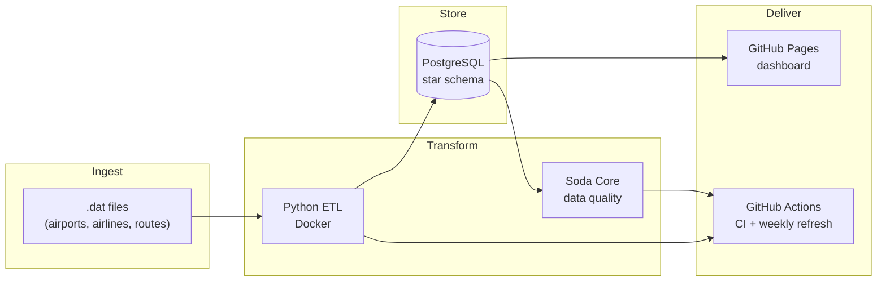

# Open Flights Data Pipeline

[](https://github.com/gvarun20/openflights-pipeline/actions/workflows/ci.yml)
[](https://github.com/gvarun20/openflights-pipeline/actions/workflows/scheduled-etl.yml)
[](https://gvarun20.github.io/openflights-pipeline/)

> **66,316 flight routes** · star-schema warehouse · Python ETL · Soda data quality · Docker · GitHub CI · live dashboard

**[📊 Live Dashboard](https://gvarun20.github.io/openflights-pipeline/)** · **[📖 Full Documentation](DOCUMENTATION.md)** (detailed phase-by-phase guide, CI, quality & integration tests) · **[⚙️ CI Runs](https://github.com/gvarun20/openflights-pipeline/actions)**

---

## What this project is

An end-to-end **data engineering pipeline** that transforms raw [OpenFlights](https://openflights.org/data.html) files into a PostgreSQL data warehouse, validates data quality with **Soda Core**, and visualises insights on a **live public dashboard** — no cloud account or credit card required.



---

## Tech stack at a glance

| Layer | Tools |
|-------|-------|
| Database | PostgreSQL 16 |
| ETL | Python 3.11+, psycopg2 |
| Data quality | Soda Core (8 automated checks) |
| Containers | Docker, docker-compose |
| Testing | pytest — unit + integration |
| CI/CD | GitHub Actions (CI + scheduled ETL) |
| Dashboard | HTML + Chart.js on GitHub Pages |

→ **[Complete tech stack, dependencies & setup guide](DOCUMENTATION.md)**

---

## Key numbers

| | |
|---|---:|
| Routes loaded | **66,316** |
| Airports | 7,698 |
| Airlines | 6,162 |
| Busiest hub | ATL — 1,826 routes |
| Data quality checks | **8 passing** |

---

## Quick start

**One command (local, after PostgreSQL is running):**
```powershell
cd openflights-pipeline
.\scripts\run_pipeline.ps1
```

**Docker (learning path — see [DOCKER.md](openflights-pipeline/DOCKER.md)):**
```powershell
cd openflights-pipeline
copy .env.example .env
docker compose --profile dev up -d              # Postgres + pgAdmin + dashboard
docker compose --profile pipeline up -d postgres
docker compose --profile pipeline run --rm etl  # Load data
```

**Docker one-command pipeline:**
```powershell
.\scripts\run_pipeline_docker.ps1
```

**Step by step:**
```powershell
cd openflights-pipeline
py -m pip install -r requirements.txt -r requirements-dev.txt
py scripts/setup_db.py          # after editing .env
py -m etl.run_etl --init --validate
py dashboard/export_snapshot.py
py -m pytest tests/ -v
```

**Make (Git Bash / WSL):**
```bash
cd openflights-pipeline
make pipeline
```

---

## Data quality

After every ETL run, **Soda Core** validates the warehouse:

| Check | Rule |
|-------|------|
| Route count | 65,000 – 67,000 rows |
| Null FKs | No null airline or airport IDs in `fact_routes` |
| Stops | All values ≥ 0 |
| Dimensions | Airports > 7k, airlines > 6k, equipment > 100 |

```powershell
py -m quality.run_checks -v
```

Checks live in `openflights-pipeline/quality/checks.yml`.

---

## Automation

| Workflow | Trigger | What it does |
|----------|---------|--------------|
| **CI Pipeline** | Every push / PR | Unit tests → ETL → Soda checks → integration tests → Docker build |
| **Scheduled Pipeline** | Weekly (Mon 06:00 UTC) + manual | Full ETL → quality → refresh dashboard JSON → deploy |

---

## Project structure

```
├── DOCUMENTATION.md       ← complete reference (start here)
├── docs/                  ← live dashboard (GitHub Pages)
├── sql/                   ← schema + analytics queries
└── openflights-pipeline/
    ├── etl/               ← Python ETL
    ├── quality/           ← Soda Core checks
    ├── data/              ← OpenFlights .dat files
    ├── tests/             ← unit + integration tests
    ├── scripts/           ← run_pipeline.ps1
    ├── Dockerfile
    └── docker-compose.yml
```

---

## What I'd add in production

- Orchestrator (Prefect / Airflow) for retries and lineage
- Cloud Postgres (RDS / Cloud SQL) with managed backups
- Grafana + postgres_exporter for runtime monitoring
- dbt layer for business-facing SQL models
- Alerting on failed Soda checks (Slack / PagerDuty)

---

## License

MIT — see [LICENSE](LICENSE).
