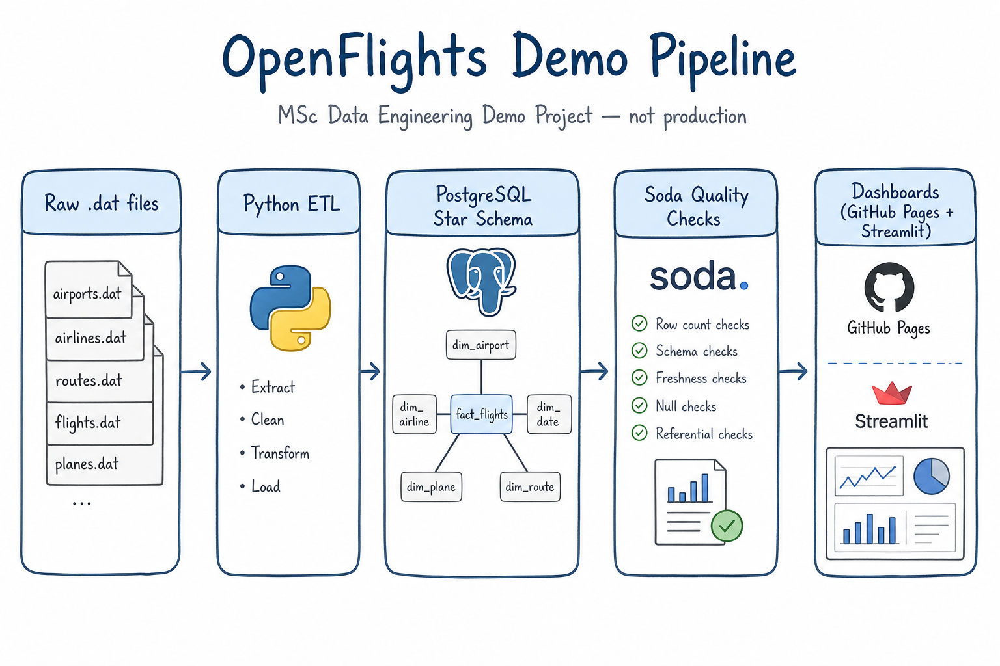

# Open Flights Data Pipeline

[](https://github.com/gvarun20/openflights-pipeline/actions/workflows/ci.yml)
[](https://gvarun20.github.io/openflights-pipeline/)

> **MSc portfolio demo** · 66,316 flight routes · PostgreSQL · Python ETL · free dashboard  
> *Built to show coursework skills — not a production airline system*

---

## Live demo

**Dashboard:** https://gvarun20.github.io/openflights-pipeline/

**Repo:** https://github.com/gvarun20/openflights-pipeline

---

## Watch the demo (optional — Loom)

Record a ~2 min walkthrough on [Loom](https://www.loom.com) and paste your link here:

[](YOUR_LOOM_URL)

**Quick script:** show dashboard → show GitHub repo + green CI badge → say it's a student demo project.

---

## Architecture



→ Column dictionary: **[METADATA.md](METADATA.md)**  
→ Full notes: **[DOCUMENTATION.md](DOCUMENTATION.md)**

---

## What this project is

Public [OpenFlights](https://openflights.org/data.html) data → Python ETL → PostgreSQL star schema → quality checks → **GitHub Pages dashboard**.

**Demo project for my master's portfolio** — not live airline data or production infrastructure.

---

## Highlights

| | |
|---|---:|
| Routes loaded | 66,316 |
| Tests | 23 |
| Soda checks | 8 |
| Busiest hub | ATL |
| Hosting cost | £0 |

---

## Quick start

```powershell
cd openflights-pipeline
.\scripts\run_pipeline.ps1
```

**Docker:** see [DOCKER.md](openflights-pipeline/DOCKER.md)

---

## Repo extras

| File | Purpose |
|------|---------|
| [METADATA.md](METADATA.md) | What each table/column means |
| [PORTFOLIO.md](PORTFOLIO.md) | CV / LinkedIn snippets |
| [docs/GITHUB_PROFILE_README.md](docs/GITHUB_PROFILE_README.md) | GitHub profile README template |
| Issue templates | Data bug · Enhancement idea |

---

## GitHub Actions status

| Workflow | What it does |
|----------|--------------|
| **CI Pipeline** | Tests + ETL + quality + Docker — should be green |
| **Deploy Dashboard** | Pushes `docs/` to `gh-pages` branch |

**About the red badge:** If **CI Pipeline** and **Deploy Dashboard** are green, you are fine. A separate GitHub job called **"pages build and deployment"** (on the `gh-pages` branch) can fail even when the site is live — it is not your main CI. See [DOCUMENTATION.md](DOCUMENTATION.md#143-github-pages-setup-note).

---

## License

MIT — see [LICENSE](LICENSE).

*MSc demo · [gvarun20](https://github.com/gvarun20)*
