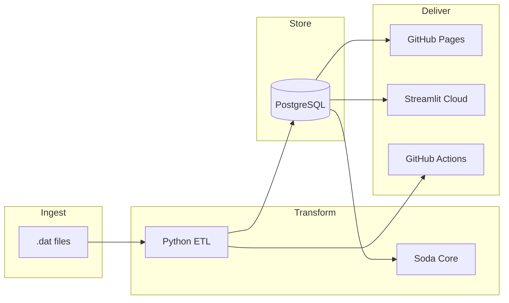

# Open Flights Data Pipeline

[](https://github.com/gvarun20/openflights-pipeline/actions/workflows/ci.yml)
[](https://github.com/gvarun20/openflights-pipeline/actions/workflows/scheduled-etl.yml)
[](https://gvarun20.github.io/openflights-pipeline/)
[](https://openflights-pipeline.streamlit.app)

> **66,316 flight routes** · PostgreSQL star schema · Python ETL · Soda data quality · Docker · GitHub Actions · dual live dashboards

---

## Live demos

| Demo | Link | Best for |
|------|------|----------|
| **Static dashboard** | **[gvarun20.github.io/openflights-pipeline](https://gvarun20.github.io/openflights-pipeline/)** | Fast load, charts & tables, always online |
| **Streamlit app** | **[Deploy guide](openflights-pipeline/dashboard/STREAMLIT_CLOUD.md)** → *update badge URL after deploy* | Interactive tabs, portfolio / interviews |
| **Documentation** | **[DOCUMENTATION.md](DOCUMENTATION.md)** | Full technical reference |
| **Portfolio guide** | **[PORTFOLIO.md](PORTFOLIO.md)** | CV, LinkedIn, GitHub profile checklist |
| **CI runs** | **[GitHub Actions](https://github.com/gvarun20/openflights-pipeline/actions)** | Proof of automated testing |

> **Recruiters:** start with the [static dashboard](https://gvarun20.github.io/openflights-pipeline/) → then [GitHub repo](https://github.com/gvarun20/openflights-pipeline) → read [PORTFOLIO.md](PORTFOLIO.md) for a 30-second pitch.

---

## What this project is

An end-to-end **data engineering pipeline** that transforms raw [OpenFlights](https://openflights.org/data.html) files into a validated PostgreSQL data warehouse and publishes insights on **public dashboards** — no paid cloud account required.


```mermaid
flowchart LR
  subgraph ingest [Ingest]
    DAT[".dat files"]
  end
  subgraph transform [Transform]
    ETL["Python ETL"]
    DQ["Soda Core"]
  end
  subgraph store [Store]
    PG[(PostgreSQL)]
  end
  subgraph deliver [Deliver]
    PG_DASH["GitHub Pages"]
    ST["Streamlit Cloud"]
    CI["GitHub Actions"]
  end
  DAT --> ETL --> PG --> DQ
  PG --> PG_DASH
  PG --> ST
  ETL --> CI
```

---

## Highlights (portfolio snapshot)

| | |
|---|---|
| Routes loaded | **66,316** |
| Automated tests | **23** (unit + integration) |
| Data quality checks | **8** (Soda Core) |
| Busiest hub | ATL — 1,826 connections |
| Top airline | Ryanair — 2,484 routes |
| CI/CD | GitHub Actions + weekly scheduled ETL |
| Containers | Docker Compose with dev / pipeline / test profiles |

**Skills:** data modelling · SQL · Python ETL · PostgreSQL · data quality · Docker · CI/CD · Streamlit · analytics

---

## Tech stack

| Layer | Tools |
|-------|-------|
| Database | PostgreSQL 16 |
| ETL | Python 3.11+, psycopg2 |
| Data quality | Soda Core |
| Containers | Docker, docker-compose (profiles) |
| Testing | pytest — 23 tests |
| CI/CD | GitHub Actions + scheduled pipeline |
| Dashboards | Chart.js (GitHub Pages) + Streamlit Cloud |

→ **[Complete documentation](DOCUMENTATION.md)** · **[Docker learning guide](openflights-pipeline/DOCKER.md)**

---

## Quick start

**Streamlit (local preview):**
```powershell
cd openflights-pipeline/dashboard
py -m pip install -r requirements.txt
py -m streamlit run app.py
```

**Deploy to Streamlit Cloud (free):** follow **[STREAMLIT_CLOUD.md](openflights-pipeline/dashboard/STREAMLIT_CLOUD.md)** — takes ~5 minutes.

**Full pipeline (local Python):**
```powershell
cd openflights-pipeline
.\scripts\run_pipeline.ps1
```

**Docker:**
```powershell
cd openflights-pipeline
docker compose --profile pipeline up -d postgres
docker compose --profile pipeline run --rm etl
```

---

## Project structure

```
├── PORTFOLIO.md           ← CV, LinkedIn, GitHub checklist
├── DOCUMENTATION.md       ← full technical reference
├── docs/                  ← GitHub Pages dashboard
└── openflights-pipeline/
    ├── etl/               ← Python ETL
    ├── quality/           ← Soda Core checks
    ├── dashboard/         ← Streamlit app + deploy guide
    ├── tests/             ← 23 pytest tests
    └── docker-compose.yml ← Docker profiles
```

---

## License

MIT — see [LICENSE](LICENSE).
