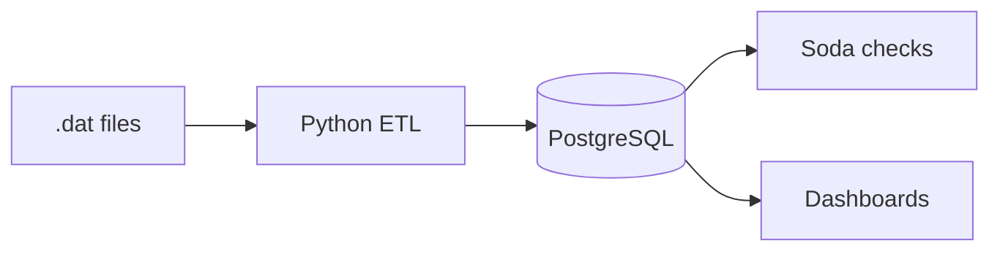

# Open Flights Data Pipeline

[](https://github.com/gvarun20/openflights-pipeline/actions/workflows/ci.yml)
[](https://gvarun20.github.io/openflights-pipeline/)
[](https://openflights-pipeline.streamlit.app)

> **MSc portfolio demo** · 66,316 flight routes · PostgreSQL · Python ETL · free dashboards  
> *Built to show coursework skills — not a production airline system*

---

## Watch the demo (2 min)

Record a short walkthrough on [Loom](https://www.loom.com) and paste your link here:

<!-- Replace YOUR_LOOM_URL with your actual share link -->
[](YOUR_LOOM_URL)

**Suggested script for your recording:**
1. Show the [static dashboard](https://gvarun20.github.io/openflights-pipeline/) (30 sec)
2. Show the Streamlit map/network tab (30 sec)
3. Quick peek at GitHub — ETL folder + green CI badge (30 sec)
4. One sentence: *"This is my MSc demo pipeline, not live flight data"* (10 sec)

---

## Architecture (demo pipeline)


<details>
<summary>Mermaid version (same diagram)</summary>


```mermaid
flowchart LR
  DAT[".dat files"] --> ETL["Python ETL"] --> PG[(PostgreSQL)]
  PG --> DQ["Soda checks"]
  PG --> DASH["Dashboards"]
```

</details>

→ Table/column meanings: **[METADATA.md](METADATA.md)**  
→ Full write-up: **[DOCUMENTATION.md](DOCUMENTATION.md)**

---

## Live demos (click these)

| Demo | Link |
|------|------|
| **Static dashboard** | https://gvarun20.github.io/openflights-pipeline/ |
| **Streamlit app** | Deploy via [STREAMLIT_CLOUD.md](openflights-pipeline/dashboard/STREAMLIT_CLOUD.md) |
| **GitHub profile README** | Copy from [docs/GITHUB_PROFILE_README.md](docs/GITHUB_PROFILE_README.md) |

---

## What this project is (honest version)

I took public [OpenFlights](https://openflights.org/data.html) files and built a **small data warehouse demo**:

```
.dat files  →  Python ETL  →  PostgreSQL  →  quality checks  →  dashboards
```

**Why I built it:** to practice what we cover in a data engineering master's — modelling, ETL, testing, Docker, and showing results to non-coders.

**What it is not:** real-time flights, paid cloud infra, or production on-call support.

---

## Highlights

| | |
|---|---:|
| Routes loaded | 66,316 |
| Tests | 23 |
| Soda checks | 8 |
| Busiest hub | ATL |
| Cost to host demos | £0 |

---

## Quick start

**Streamlit locally:**
```powershell
cd openflights-pipeline/dashboard
py -m pip install -r requirements.txt
py -m streamlit run app.py
```

**Full pipeline:**
```powershell
cd openflights-pipeline
.\scripts\run_pipeline.ps1
```

**Docker (learning stack):** see [DOCKER.md](openflights-pipeline/DOCKER.md)

---

## Repo extras (portfolio polish)

| File | What it is |
|------|------------|
| [METADATA.md](METADATA.md) | Plain-English column dictionary |
| [PORTFOLIO.md](PORTFOLIO.md) | CV / LinkedIn snippets |
| [docs/GITHUB_PROFILE_README.md](docs/GITHUB_PROFILE_README.md) | Profile README to copy |
| Issue templates | "Data bug" + "Enhancement idea" |

---

## Project structure

```
├── METADATA.md              ← what each column means
├── DOCUMENTATION.md         ← full technical notes
├── docs/architecture.png    ← diagram for README
└── openflights-pipeline/
    ├── etl/
    ├── quality/
    ├── dashboard/           ← Streamlit + maps
    └── tests/
```

---

## License

MIT — see [LICENSE](LICENSE).

*MSc demo project · [gvarun20](https://github.com/gvarun20)*
